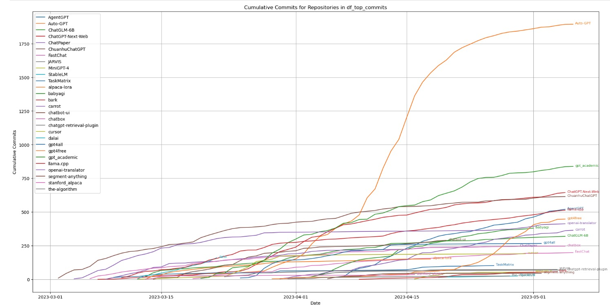
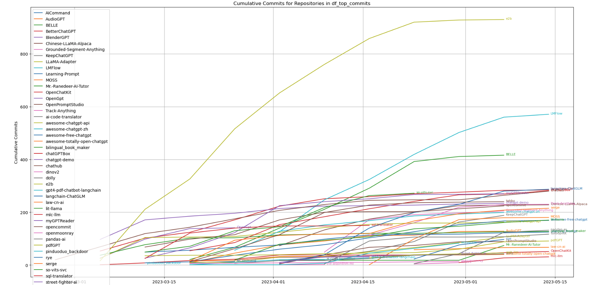
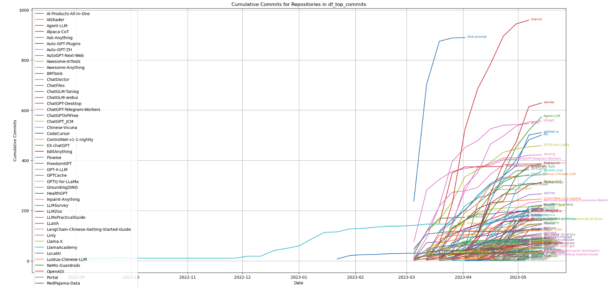

# awesome-gpt-dev

<!--rehype:style=font-size
38px; border-bottom
0; display
flex; min-height
260px; align-items
center; justify-content
center;-->

  

<!--rehype:style=text-align: center;-->

Top Github Projects Since2023-03-01:
## Table of Contents

- [awesome-gpt-dev](#awesome-gpt-dev)
  - [Table of Contents](#table-of-contents)
  - [Top Class (star\>10000)](#top-class-star10000)
  - [High Class (3000\<=star\<10000)](#high-class-3000star10000)
  - [Mid Class (1000\<=star\<3000)](#mid-class-1000star3000)
  - [Contribute](#contribute)
  - [Contributors](#contributors)
  - [Contact](#contact)
  - [Credits](#credits)
  - [License](#license)

## Top Class (star>10000)

- You can see that Auto-GPT is the project with the fastest iteration speed and the highest number of stars at present. 
- Secondly, AgentGPT, gpt4free, babyagi, llama.cpp and other projects have a relatively fast growth rate. 
- From the perspective of stars, the-algorithm has obtained a large number of stars (more than 30,000)

| repo name               | repo owner               | url                                           | description                                                                                                                                                                                                  | is_organization | main language         | stars  | topics                                                                                                                                                                                                                                                   |
|--------------------------|----------------------|------------------------------------------------------|--------------------------------------------------------------------------------------------------------------------------------------------------------------------------------------------------------------|-----------------|------------------|--------|----------------------------------------------------------------------------------------------------------------------------------------------------------------------------------------------------------------------------------------------------------|
| Auto-GPT                 | Significant-Gravitas | https://github.com/Significant-Gravitas/Auto-GPT     | An experimental open-source attempt to make GPT-4 fully autonomous.                                                                                                                                          | TRUE            | Python           | 124965 | ['python', 'ai', 'artificial-intelligence', 'openai', 'autonomous-agents', 'gpt-4']                                                                                                                                                                      |
| the-algorithm            | twitter              | https://github.com/twitter/the-algorithm             | Source code for Twitter's Recommendation Algorithm                                                                                                                                                           | TRUE            | Scala            | 56613  | []                                                                                                                                                                                                                                                       |
| gpt4all                  | nomic-ai             | https://github.com/nomic-ai/gpt4all                  | gpt4all: an ecosystem of open-source chatbots trained on a massive collections of clean assistant data including code, stories and dialogue                                                                  | TRUE            | Python           | 37350  | []                                                                                                                                                                                                                                                       |
| TaskMatrix               | microsoft            | https://github.com/microsoft/TaskMatrix              |                                                                                                                                                                                                              | TRUE            | Python           | 32461  | []                                                                                                                                                                                                                                                       |
| gpt_academic             | binary-husky         | https://github.com/binary-husky/gpt_academic         | 为GPT/GLM提供图形交互界面，特别优化论文阅读润色体验，模块化设计支持自定义快捷按钮&amp;函数插件，支持代码块表格显示，Tex公式双显示，新增Python和C++项目剖析&amp;自译解功能，PDF/LaTex论文翻译&amp;总结功能，支持并行问询多种LLM模型，支持清华chatglm等…                                                       | FALSE           | Python           | 32020  | ['academic', 'gpt-4', 'large-language-models', 'chatgpt', 'chatglm-6b']                                                                                                                                                                                  |
| segment-anything         | facebookresearch     | https://github.com/facebookresearch/segment-anything | The repository provides code for running inference with the SegmentAnything Model (SAM), links for downloading the trained model checkpoi…                                                                   | TRUE            | Jupyter Notebook | 31450  | []                                                                                                                                                                                                                                                       |
| gpt4free                 | xtekky               | https://github.com/xtekky/gpt4free                   | decentralising the Ai Industry, just some language model api's...                                                                                                                                            | FALSE           | Python           | 30827  | ['python', 'chatbot', 'reverse-engineering', 'openai', 'chatbots', 'gpt', 'language-model', 'gpt-3', 'gpt3', 'openai-api', 'gpt-4', 'gpt4', 'chatgpt', 'chatgpt-api', 'openai-chatgpt', 'chatgpt-free', 'chatgpt-4', 'chatgpt4', 'gpt4-api', 'free-gpt'] |
| llama.cpp                | ggerganov            | https://github.com/ggerganov/llama.cpp               | Port of Facebook's LLaMA model in C/C++                                                                                                                                                                      | FALSE           | C                | 25886  | []                                                                                                                                                                                                                                                       |
| stanford_alpaca          | tatsu-lab            | https://github.com/tatsu-lab/stanford_alpaca         | Code and documentation to train Stanford's Alpaca models, and generate the data.                                                                                                                             | TRUE            | Python           | 22866  | ['deep-learning', 'language-model', 'instruction-following']                                                                                                                                                                                             |
| ChatGPT-Next-Web         | Yidadaa              | https://github.com/Yidadaa/ChatGPT-Next-Web          | One-Click to deploy well-designed ChatGPT web UI on Vercel. 一键拥有你自己的 ChatGPT 网页服务。                                                                                                                           | FALSE           | TypeScript       | 22706  | ['web', 'nextjs', 'webui', 'vercel', 'chatgpt']                                                                                                                                                                                                          |
| ChatGLM-6B               | THUDM                | https://github.com/THUDM/ChatGLM-6B                  | ChatGLM-6B: An Open Bilingual Dialogue Language Model | 开源双语对话语言模型                                                                                                                                           | TRUE            | Python           | 22682  | []                                                                                                                                                                                                                                                       |
| AgentGPT                 | reworkd              | https://github.com/reworkd/AgentGPT                  | <g-emoji class="g-emoji" alias="robot" fallback-src="https://github.githubassets.com/images/icons/emoji/unicode/1f916.png">�</g-emoji> Assemble, configure, and deploy autonomous AI Agents in your browser. | TRUE            | TypeScript       | 20965  | ['agent', 'agi', 'openai', 'gpt', 'next', 't3', 't3-stack', 'langchain', 'autogpt', 'baby-agi', 'agentgpt']                                                                                                                                              |
| JARVIS                   | microsoft            | https://github.com/microsoft/JARVIS                  | JARVIS, a system to connect LLMs with ML community. Paper: <a href="https://arxiv.org/pdf/2303.17580.pdf" rel="nofollow">https://arxiv.org/pdf/2303.17580.pdf</a>                                            | TRUE            | Python           | 19859  | ['pytorch', 'deep-learning', 'platform']                                                                                                                                                                                                                 |
| FastChat                 | lm-sys               | https://github.com/lm-sys/FastChat                   | An open platform for training, serving, and evaluating large languages. Release repo for Vicuna and FastChat-T5.                                                                                             | TRUE            | Python           | 18103  | []                                                                                                                                                                                                                                                       |
| MiniGPT-4                | Vision-CAIR          | https://github.com/Vision-CAIR/MiniGPT-4             | MiniGPT-4: Enhancing Vision-language Understanding with Advanced Large Language Models                                                                                                                       | TRUE            | Python           | 17964  | []                                                                                                                                                                                                                                                       |
| bark                     | suno-ai              | https://github.com/suno-ai/bark                      | <g-emoji class="g-emoji" alias="loud_sound" fallback-src="https://github.githubassets.com/images/icons/emoji/unicode/1f50a.png">�</g-emoji> Text-Prompted Generative Audio Model                             | TRUE            | Jupyter Notebook | 17034  | []                                                                                                                                                                                                                                                       |
| chatgpt-retrieval-plugin | openai               | https://github.com/openai/chatgpt-retrieval-plugin   | The ChatGPT Retrieval Plugin lets you easily search and find personal or work documents by asking questions in everyday language.                                                                            | TRUE            | Python           | 15780  | ['chatgpt', 'chatgpt-plugins']                                                                                                                                                                                                                           |
| openai-translator        | yetone               | https://github.com/yetone/openai-translator          | 基于 ChatGPT API 的划词翻译浏览器插件和跨平台桌面端应用 - Browser extension and cross-platform desktop application for translation based on ChatGPT API.                                                                          | FALSE           | TypeScript       | 15533  | ['chrome-extension', 'browser-extension', 'translator', 'translation', 'openai', 'translator-app', 'chatgpt']                                                                                                                                            |
| cursor                   | getcursor            | https://github.com/getcursor/cursor                  | An editor made for programming with AI <g-emoji class="g-emoji" alias="robot" fallback-src="https://github.githubassets.com/images/icons/emoji/unicode/1f916.png">�</g-emoji>                                | TRUE            |                  | 15399  | []                                                                                                                                                                                                                                                       |
| StableLM                 | Stability-AI         | https://github.com/Stability-AI/StableLM             | StableLM: Stability AI Language Models                                                                                                                                                                       | TRUE            | Jupyter Notebook | 13539  | []                                                                                                                                                                                                                                                       |
| babyagi                  | yoheinakajima        | https://github.com/yoheinakajima/babyagi             |                                                                                                                                                                                                              | FALSE           | Python           | 13411  | []                                                                                                                                                                                                                                                       |
| chatbot-ui               | mckaywrigley         | https://github.com/mckaywrigley/chatbot-ui           | An open source ChatGPT UI.                                                                                                                                                                                   | FALSE           | TypeScript       | 12927  | []                                                                                                                                                                                                                                                       |
| alpaca-lora              | tloen                | https://github.com/tloen/alpaca-lora                 | Instruct-tune LLaMA on consumer hardware                                                                                                                                                                     | FALSE           | Jupyter Notebook | 12097  | []                                                                                                                                                                                                                                                       |
| dalai                    | cocktailpeanut       | https://github.com/cocktailpeanut/dalai              | The simplest way to run LLaMA on your local machine                                                                                                                                                          | FALSE           | CSS              | 11081  | ['ai', 'llama', 'llm']                                                                                                                                                                                                                                   |
| ChatPaper                | kaixindelele         | https://github.com/kaixindelele/ChatPaper            | Use ChatGPT to summarize the arXiv papers. 全流程加速科研，利用chatgpt进行论文总结+润色+审稿+审稿回复                                                                                                                                | FALSE           | Python           | 11037  | ['paper', 'arxiv']                                                                                                                                                                                                                                       |
| carrot                   | xx025                | https://github.com/xx025/carrot                      | Free ChatGPT Site List 这儿为你准备了众多免费好用的ChatGPT镜像站点，当前100+站点                                                                                                                                                    | FALSE           |                  | 10333  | ['chat', 'ai', 'openai', 'chatgpt', 'freechatgpt']                                                                                                                                                                                                       |
| chatbox                  | Bin-Huang            | https://github.com/Bin-Huang/chatbox                 | Your Ultimate Copilot on the Desktop. Chatbox is a desktop app for GPT-4 / GPT-3.5 (OpenAI API) that supports Windows, Mac &amp; Linux.                                                                      | FALSE           | TypeScript       | 10325  | ['openai', 'chatgpt']                                                                                                                                                                                                                                    |
| ChuanhuChatGPT           | GaiZhenbiao          | https://github.com/GaiZhenbiao/ChuanhuChatGPT        | GUI for ChatGPT API and any LLM                                                                                                                                                                              | FALSE           | Python           | 10018  | ['chatbot', 'bilibili', 'chatgpt-api']                                                                                                                                                                                                                   |

## High Class (3000<=star<10000)

- In high-level projects, e2b, LMFlow, BELLE commit are the most active, and other projects are not the same 
- Top stars are MOSS, Granded-Segment-Anything, chatGPTBox, etc., among which MOSS won 8,000+ star stars in about half a month 
- In this batch of projects, some list

| repo name               | repo owner               | url                                           | description                                                                                                                                                                                                  | is_organization | main language         | stars  | topics                                                                                                                                                                                                                                                   |
|------------------------------|---------------------|------------------------------------------------------------|-----------------------------------------------------------------------------------------------------------------------------------------------------------------------------------------------------------------------------------------------------------------------------------------------------------------------------------------------------|-----------------|------------------|-------|-----------------------------------------------------------------------------------------------------------------------------------------------------------------------------------------|
| gpt4-pdf-chatbot-langchain   | mayooear            | https://github.com/mayooear/gpt4-pdf-chatbot-langchain     | GPT4 &amp; LangChain Chatbot for large PDF docs                                                                                                                                                                                                                                                                                                     | FALSE           | TypeScript       | 9711  | ['pdf', 'typescript', 'nextjs', 'openai', 'gpt4', 'langchain']                                                                                                                          |
| dolly                        | databrickslabs      | https://github.com/databrickslabs/dolly                    | Databricks’ Dolly, a large language model trained on the Databricks Machine Learning Platform                                                                                                                                                                                                                                                       | TRUE            | Python           | 9634  | ['chatbot', 'gpt', 'databricks', 'dolly']                                                                                                                                               |
| MOSS                         | OpenLMLab           | https://github.com/OpenLMLab/MOSS                          | An open-source tool-augmented conversational language model from Fudan University                                                                                                                                                                                                                                                                   | TRUE            | Python           | 9482  | ['natural-language-processing', 'deep-learning', 'text-generation', 'dialogue-systems', 'large-language-models', 'chatgpt']                                                             |
| the-algorithm-ml             | twitter             | https://github.com/twitter/the-algorithm-ml                | Source code for Twitter's Recommendation Algorithm                                                                                                                                                                                                                                                                                                  | TRUE            | Python           | 9385  | []                                                                                                                                                                                      |
| OpenChatKit                  | togethercomputer    | https://github.com/togethercomputer/OpenChatKit            |                                                                                                                                                                                                                                                                                                                                                     | TRUE            | Python           | 8109  | []                                                                                                                                                                                      |
| Grounded-Segment-Anything    | IDEA-Research       | https://github.com/IDEA-Research/Grounded-Segment-Anything | Marrying Grounding DINO with Segment Anything &amp; Stable Diffusion &amp; Tag2Text &amp; BLIP &amp; Whisper &amp; ChatBot - Automatically Detect , Segment a…                                                                                                                                                                                      | TRUE            | Jupyter Notebook | 7954  | ['speech', 'caption', 'data-generation', 'open-vocabulary-detection', 'open-vocabulary-segmentation', 'automatic-labeling-system']                                                      |
| chatGPTBox                   | josStorer           | https://github.com/josStorer/chatGPTBox                    | Integrating ChatGPT into your browser deeply, everything you need is here                                                                                                                                                                                                                                                                           | FALSE           | JavaScript       | 7370  | ['chrome-extension', 'browser-extension', 'firefox-addon', 'safari-extension', 'firefox-extension', 'edge-extension', 'chatgpt']                                                        |
| AudioGPT                     | AIGC-Audio          | https://github.com/AIGC-Audio/AudioGPT                     | AudioGPT: Understanding and Generating Speech, Music, Sound, and Talking Head                                                                                                                                                                                                                                                                       | TRUE            | Python           | 7331  | ['audio', 'music', 'speech', 'sound', 'gpt', 'talking-head']                                                                                                                            |
| so-vits-svc                  | svc-develop-team    | https://github.com/svc-develop-team/so-vits-svc            | SoftVC VITS Singing Voice Conversion                                                                                                                                                                                                                                                                                                                | TRUE            | Python           | 7302  | []                                                                                                                                                                                      |
| KeepChatGPT                  | xcanwin             | https://github.com/xcanwin/KeepChatGPT                     | ChatGPT畅聊插件。解决所有报错，让我们的AI体验无比顺畅、丝滑、高效。持续更新的增强功能，如取消审计等。解决的报错如下: (1) NetworkError when attempting to fetch resource. (2) Something went wr…                                                                                                                                                                                                          | FALSE           | JavaScript       | 7302  | ['ai', 'userscript', 'openai', 'chatgpt']                                                                                                                                               |
| Chinese-LLaMA-Alpaca         | ymcui               | https://github.com/ymcui/Chinese-LLaMA-Alpaca              | 中文LLaMA&amp;Alpaca大语言模型+本地CPU/GPU部署 (Chinese LLaMA &amp; Alpaca LLMs)                                                                                                                                                                                                                                                                               | FALSE           | Python           | 7202  | ['nlp', 'llama', 'quantization', 'alpaca', 'plm', 'pre-trained-language-models', 'large-language-models', 'llm']                                                                        |
| chatgpt-demo                 | anse-app            | https://github.com/anse-app/chatgpt-demo                   | Minimal UI for ChatGPT.                                                                                                                                                                                                                                                                                                                             | TRUE            | TypeScript       | 6819  | ['astro', 'openai', 'gpt-3', 'openai-api', 'chatgpt', 'gpt-35', 'gpt-35-turbo']                                                                                                         |
| tabby                        | TabbyML             | https://github.com/TabbyML/tabby                           | Self-hosted AI coding assistant                                                                                                                                                                                                                                                                                                                     | TRUE            | Python           | 6020  | []                                                                                                                                                                                      |
| awesome-chatgpt-zh           | yzfly               | https://github.com/yzfly/awesome-chatgpt-zh                | ChatGPT 中文指南<g-emoji class="g-emoji" alias="fire" fallback-src="https://github.githubassets.com/images/icons/emoji/unicode/1f525.png">�</g-emoji>，ChatGPT 中文调教指南，指令指南，精选资源清单，更好的使用 chatGPT 让你的生产力 up up up! <g-emoji class="g-emoji" alias="rocket" fallback-src="https://github.githubassets.com/images/icons/emoji/unicode/1f680.png">�</g-emoji> | FALSE           |                  | 5695  | ['awesome', 'awesome-list', 'gpt-4', 'chatgpt', 'chat-gpt', 'chatgpt3', 'chatgpt35-turbo']                                                                                              |
| bilingual_book_maker         | yihong0618          | https://github.com/yihong0618/bilingual_book_maker         | Make bilingual epub books Using AI translate                                                                                                                                                                                                                                                                                                        | FALSE           | Python           | 5598  | []                                                                                                                                                                                      |
| mlc-llm                      | mlc-ai              | https://github.com/mlc-ai/mlc-llm                          | Enable everyone to develop, optimize and deploy AI models natively on everyone's devices.                                                                                                                                                                                                                                                           | TRUE            | Python           | 5260  | ['language-model', 'tvm', 'llm', 'machine-learning-compilation']                                                                                                                        |
| web-llm                      | mlc-ai              | https://github.com/mlc-ai/web-llm                          | Bringing large-language models and chat to web browsers. Everything runs inside the browser with no server support.                                                                                                                                                                                                                                 | TRUE            | Python           | 5258  | ['deep-learning', 'language-model', 'webgpu', 'tvm', 'webml', 'llm', 'chatgpt']                                                                                                         |
| rye                          | mitsuhiko           | https://github.com/mitsuhiko/rye                           |  an experimental alternative to poetry/pip/pipenv/pyenv/venv/virtualenv/pdm/hatch/…                                                                                                                                                                                                                                                                 | FALSE           | Rust             | 5145  | []                                                                                                                                                                                      |
| LMFlow                       | OptimalScale        | https://github.com/OptimalScale/LMFlow                     | An Extensible Toolkit for Finetuning and Inference of Large Foundation Models. Large Model for All.                                                                                                                                                                                                                                                 | TRUE            | Python           | 5003  | ['deep-learning', 'pytorch', 'transformer', 'pretrained-models', 'language-model', 'instruction-following', 'chatgpt']                                                                  |
| pinduoduo_backdoor           | davinci1010         | https://github.com/davinci1010/pinduoduo_backdoor          | 拼多多apk内嵌提权代码，及动态下发dex分析                                                                                                                                                                                                                                                                                                                             | FALSE           |                  | 4945  | ['pdd']                                                                                                                                                                                 |
| BELLE                        | LianjiaTech         | https://github.com/LianjiaTech/BELLE                       | BELLE: Be Everyone's Large Language model Engine（开源中文对话大模型）                                                                                                                                                                                                                                                                                         | TRUE            | HTML             | 4832  | ['bloom', 'chinese-nlp', 'llama', 'lora', 'instruction-set', 'open-models', 'instruct-gpt', 'gpt-q', 'gpt-evaluation', 'instruct-finetune']                                             |
| wolverine                    | biobootloader       | https://github.com/biobootloader/wolverine                 |                                                                                                                                                                                                                                                                                                                                                     | FALSE           | Python           | 4743  | []                                                                                                                                                                                      |
| chathub                      | chathub-dev         | https://github.com/chathub-dev/chathub                     | All-in-one chatbot client                                                                                                                                                                                                                                                                                                                           | TRUE            | TypeScript       | 4702  | []                                                                                                                                                                                      |
| street-fighter-ai            | linyiLYi            | https://github.com/linyiLYi/street-fighter-ai              | This is an AI agent for Street Fighter II Champion Edition.                                                                                                                                                                                                                                                                                         | FALSE           | Python           | 4683  | []                                                                                                                                                                                      |
| awesome-chatgpt-api          | reorx               | https://github.com/reorx/awesome-chatgpt-api               | Curated list of apps and tools that not only use the new ChatGPT API, but also allow users to configure their own API keys, enabling free…                                                                                                                                                                                                          | FALSE           | Python           | 4504  | ['awesome', 'awesome-list', 'chatgpt', 'chatgpt-api']                                                                                                                                   |
| langchain-ChatGLM            | imClumsyPanda       | https://github.com/imClumsyPanda/langchain-ChatGLM         | langchain-ChatGLM, local knowledge based ChatGLM with langchain ｜ 基于本地知识的 ChatGLM 问答                                                                                                                                                                                                                                                                | FALSE           | Python           | 4472  | ['llm', 'llms', 'langchain', 'chatglm', 'chatglm-6b']                                                                                                                                   |
| dinov2                       | facebookresearch    | https://github.com/facebookresearch/dinov2                 | PyTorch code and models for the DINOv2 self-supervised learning method.                                                                                                                                                                                                                                                                             | TRUE            | Python           | 4466  | []                                                                                                                                                                                      |
| OpenPromptStudio             | Moonvy              | https://github.com/Moonvy/OpenPromptStudio                 | <g-emoji class="g-emoji" alias="bowl_with_spoon" fallback-src="https://github.githubassets.com/images/icons/emoji/unicode/1f963.png">�</g-emoji> AIGC 提示词可视化编辑器 | OPS | Open Prompt Studio                                                                                                                                                          | TRUE            | Vue              | 3990  | ['ai', 'prompts', 'aigc', 'open-prompt-studio']                                                                                                                                         |
| serge                        | nsarrazin           | https://github.com/nsarrazin/serge                         | A web interface for chatting with Alpaca through llama.cpp. Fully dockerized, with an easy to use API.                                                                                                                                                                                                                                              | FALSE           | Python           | 3972  | ['python', 'docker', 'nginx', 'web', 'svelte', 'llama', 'alpaca', 'tailwindcss', 'fastapi', 'sveltekit', 'llamacpp']                                                                    |
| Track-Anything               | gaomingqi           | https://github.com/gaomingqi/Track-Anything                | Track-Anything is a flexible and interactive tool for video object tracking and segmentation, based on Segment Anything, XMem, and E2FGVI.                                                                                                                                                                                                          | FALSE           | Python           | 3953  | ['video-object-segmentation', 'video-object-tracking', 'segment-anything', 'track-anything', 'interactive-tracking', 'inpaint-anything']                                                |
| e2b                          | e2b-dev             | https://github.com/e2b-dev/e2b                             | Your own virtual developer. e2b lets you build &amp; deploy specialized AI agents that build software for you based on your instructions.                                                                                                                                                                                                           | TRUE            | Python           | 3871  | ['react', 'nodejs', 'python', 'development', 'typescript', 'ai', 'nextjs', 'ide', 'devtools', 'openai', 'software', 'gpt', 'firecracker', 'coding-editor', 'gpt-4', 'llm', 'langchain'] |
| myGPTReader                  | madawei2699         | https://github.com/madawei2699/myGPTReader                 | A community-driven way to read and chat with AI bots - powered by chatGPT.                                                                                                                                                                                                                                                                          | FALSE           | Python           | 3860  | ['crawler', 'scraper', 'ai', 'prompt', 'openai', 'reader', 'slack-bot', 'embedding', 'daily-news', 'hot-news', 'chatgpt', 'gpt-35-turbo']                                               |
| pandas-ai                    | gventuri            | https://github.com/gventuri/pandas-ai                      | Pandas AI is a Python library that integrates generative artificial intelligence capabilities into Pandas, making dataframes conversational                                                                                                                                                                                                         | FALSE           | Python           | 3760  | ['pandas', 'python', 'llm']                                                                                                                                                             |
| openmoonray                  | dreamworksanimation | https://github.com/dreamworksanimation/openmoonray         | MoonRay is DreamWorks’ open-source, award-winning, state-of-the-art production MCRT renderer.                                                                                                                                                                                                                                                       | TRUE            | CMake            | 3746  | ['moonray']                                                                                                                                                                             |
| Learning-Prompt              | thinkingjimmy       | https://github.com/thinkingjimmy/Learning-Prompt           | 免费 Prompt Engineering 教程                                                                                                                                                                                                                                                                                                                            | FALSE           | CSS              | 3664  | ['prompt', 'prompt-toolkit', 'prompt-engineering']                                                                                                                                      |
| awesome-totally-open-chatgpt | nichtdax            | https://github.com/nichtdax/awesome-totally-open-chatgpt   | A list of totally open alternatives to ChatGPT                                                                                                                                                                                                                                                                                                      | FALSE           |                  | 3654  | ['awesome-list', 'awesome', 'open-source', 'alternative', 'awesome-lists', 'chatgpt']                                                                                                   |
| BetterChatGPT                | ztjhz               | https://github.com/ztjhz/BetterChatGPT                     | An amazing UI for OpenAI's ChatGPT (Website + Windows + MacOS + Linux)                                                                                                                                                                                                                                                                              | FALSE           | TypeScript       | 3642  | ['chatbot', 'free', 'gpt-3', 'gpt-4', 'chatgpt', 'better-chat-gpt']                                                                                                                     |
| Mr.-Ranedeer-AI-Tutor        | JushBJJ             | https://github.com/JushBJJ/Mr.-Ranedeer-AI-Tutor           | A GPT-4 AI Tutor Prompt for customizable personalized learning experiences.                                                                                                                                                                                                                                                                         | FALSE           |                  | 3620  | []                                                                                                                                                                                      |
| opencommit                   | di-sukharev         | https://github.com/di-sukharev/opencommit                  | GPT CLI to auto-generate impressive commits in 1 second <g-emoji class="g-emoji" alias="exploding_head" fallback-src="https://github.githubassets.com/images/icons/emoji/unicode/1f92f.png">�</g-emoji><g-emoji class="g-emoji" alias="gun" fallback-src="https://github.githubassets.com/images/icons/emoji/unicode/1f52b.png">�</g-emoji>         | FALSE           | TypeScript       | 3568  | ['git', 'productivity', 'ai', 'artificial-intelligence', 'gpt', 'chatgpt', 'ai-commit', 'ai-commits']                                                                                   |
| BlenderGPT                   | gd3kr               | https://github.com/gd3kr/BlenderGPT                        | Use commands in English to control Blender with OpenAI's GPT-4                                                                                                                                                                                                                                                                                      | FALSE           | Python           | 3519  | []                                                                                                                                                                                      |
| AICommand                    | keijiro             | https://github.com/keijiro/AICommand                       | ChatGPT integration with Unity Editor                                                                                                                                                                                                                                                                                                               | FALSE           | C#               | 3448  | []                                                                                                                                                                                      |
| OpenGpt                      | futantan            | https://github.com/futantan/OpenGpt                        | Create your own ChatGPT App in seconds.                                                                                                                                                                                                                                                                                                             | FALSE           | TypeScript       | 3423  | ['application', 'openai', 'chatgpt']                                                                                                                                                    |
| law-cn-ai                    | lvwzhen             | https://github.com/lvwzhen/law-cn-ai                       | <g-emoji class="g-emoji" alias="balance_scale" fallback-src="https://github.githubassets.com/images/icons/emoji/unicode/2696.png">⚖️</g-emoji> AI 法律助手                                                                                                                                                                                              | FALSE           | TypeScript       | 3395  | ['law', 'openai', 'chatgpt']                                                                                                                                                            |
| turbopilot                   | ravenscroftj        | https://github.com/ravenscroftj/turbopilot                 | Turbopilot is an open source large-language-model based code completion engine that runs locally on CPU                                                                                                                                                                                                                                             | FALSE           | Python           | 3353  | ['machine-learning', 'cpp', 'code-completion', 'language-model']                                                                                                                        |
| pdfGPT                       | bhaskatripathi      | https://github.com/bhaskatripathi/pdfGPT                   | PDF GPT allows you to chat with the contents of your PDF file by using GPT capabilities. The only open source solution to turn your pdf f…                                                                                                                                                                                                          | FALSE           | Python           | 3296  | ['chatpdf', 'pdfgpt', 'chatwithpdf']                                                                                                                                                    |
| awesome-free-chatgpt         | LiLittleCat         | https://github.com/LiLittleCat/awesome-free-chatgpt        | <g-emoji class="g-emoji" alias="free" fallback-src="https://github.githubassets.com/images/icons/emoji/unicode/1f193.png">�</g-emoji>免费的 ChatGPT 镜像网站列表，持续更新。List of free ChatGPT mirror sites, continuously updated.                                                                                                                               | FALSE           | Python           | 3242  | ['chat', 'free', 'awsome', 'awesome-list', 'chatgpt', 'freechatgpt']                                                                                                                    |
| sql-translator               | whoiskatrin         | https://github.com/whoiskatrin/sql-translator              | SQL Translator is a tool for converting natural language queries into SQL code using artificial intelligence. This project is 100% free a…                                                                                                                                                                                                          | FALSE           | TypeScript       | 3201  | ['query', 'sql', 'postgresql', 'datascience', 'data-engineering', 'dataset', 'openai', 'data-analysis', 'dataquery']                                                                    |
| LLaMA-Adapter                | ZrrSkywalker        | https://github.com/ZrrSkywalker/LLaMA-Adapter              | Fine-tuning LLaMA to follow Instructions within 1 Hour and 1.2M Parameters                                                                                                                                                                                                                                                                          | FALSE           | Python           | 3143  | []                                                                                                                                                                                      |
| lit-llama                    | Lightning-AI        | https://github.com/Lightning-AI/lit-llama                  | Implementation of the LLaMA language model based on nanoGPT. Supports flash attention, Int8 and GPTQ 4bit quantization, LoRA and LLaMA-Ad…                                                                                                                                                                                                          | TRUE            | Python           | 3070  | []                                                                                                                                                                                      |
| ai-code-translator           | mckaywrigley        | https://github.com/mckaywrigley/ai-code-translator         | Use AI to translate code from one language to another.                                                                                                                                                                                                                                                                                              | FALSE           | TypeScript       | 3058  | []                                                                                                                                                                                      |

## Mid Class (1000<=star<3000)

- The medium-level warehouse presents a "mold battle" situation. The more active ones are marvin, click-prompt, wenda 
- zotero-gpt. This warehouse did not appear in March, but on 2022-08-19.

| repo name               | repo owner               | url                                           | description                                                                                                                                                                                                  | is_organization | main language         | stars  | topics                                                                                                                                                                                                                                                   |
|------------------------------|---------------------|------------------------------------------------------------|-----------------------------------------------------------------------------------------------------------------------------------------------------------------------------------------------------------------------------------------------------------------------------------------------------------------------------------------------------|-----------------|------------------|-------|-----------------------------------------------------------------------------------------------------------------------------------------------------------------------------------------|
| llm                                       | rustformers                   | https://github.com/rustformers/llm                                      | Run inference for Large Language Models on CPU, with Rust <g-emoji class="g-emoji" alias="crab" fallback-src="https://github.githubassets.com/images/icons/emoji/unicode/1f980.png">�</g-emoji><g-emoji class="g-emoji" alias="rocket" fallback-src="https://github.githubassets.com/images/icons/emoji/unicode/1f680.png">�</g-emoji><g-emoji class="g-emoji" alias="llama" fallback-src="https://github.githubassets.com/images/icons/emoji/unicode/1f999.png">�</g-emoji>      | TRUE            | Rust             | 2976  | []                                                                                                                                                                                                                                                                          |
| GPTCache                                  | zilliztech                    | https://github.com/zilliztech/GPTCache                                  | GPTCache is a library for creating semantic cache to store responses from LLM queries.                                                                                                                                                                                                                                                                                                                                                                                            | TRUE            | Python           | 2955  | ['redis', 'chatbot', 'openai', 'llama', 'gpt', 'memcache', 'semantic-search', 'similarity-search', 'dolly', 'vector-search', 'milvus', 'aigc', 'llm', 'chatgpt', 'langchain', 'chatgpt-api', 'llama-index', 'autogpt', 'babyagi']                                           |
| LLMsPracticalGuide                        | Mooler0410                    | https://github.com/Mooler0410/LLMsPracticalGuide                        | A curated list of practical guide resources of LLMs (LLMs Tree, Examples, Papers)                                                                                                                                                                                                                                                                                                                                                                                                 | FALSE           |                  | 2851  | ['nlp', 'natural-language-processing', 'survey', 'large-language-models']                                                                                                                                                                                                   |
| Inpaint-Anything                          | geekyutao                     | https://github.com/geekyutao/Inpaint-Anything                           | Inpaint anything using Segment Anything and inpainting models.                                                                                                                                                                                                                                                                                                                                                                                                                    | FALSE           | Jupyter Notebook | 2844  | []                                                                                                                                                                                                                                                                          |
| mojo                                      | modularml                     | https://github.com/modularml/mojo                                       | The Mojo Programming Language                                                                                                                                                                                                                                                                                                                                                                                                                                                     | TRUE            |                  | 2805  | []                                                                                                                                                                                                                                                                          |
| ai-shell                                  | BuilderIO                     | https://github.com/BuilderIO/ai-shell                                   | A CLI that converts natural language to shell commands.                                                                                                                                                                                                                                                                                                                                                                                                                           | TRUE            | TypeScript       | 2776  | []                                                                                                                                                                                                                                                                          |
| document.ai                               | GanymedeNil                   | https://github.com/GanymedeNil/document.ai                              | 基于向量数据库与GPT3.5的通用本地知识库方案(A universal local knowledge base solution based on vector database and GPT3.5)                                                                                                                                                                                                                                                                                                                                                                           | FALSE           | Python           | 2735  | []                                                                                                                                                                                                                                                                          |
| thumbhash                                 | evanw                         | https://github.com/evanw/thumbhash                                      | A very compact representation of an image placeholder                                                                                                                                                                                                                                                                                                                                                                                                                             | FALSE           | Swift            | 2715  | []                                                                                                                                                                                                                                                                          |
| ChatDoctor                                | Kent0n-Li                     | https://github.com/Kent0n-Li/ChatDoctor                                 |                                                                                                                                                                                                                                                                                                                                                                                                                                                                                   | FALSE           | Python           | 2657  | []                                                                                                                                                                                                                                                                          |
| ChatGPT-Telegram-Workers                  | TBXark                        | https://github.com/TBXark/ChatGPT-Telegram-Workers                      | Deploy your own Telegram ChatGPT bot on Cloudflare Workers with ease.                                                                                                                                                                                                                                                                                                                                                                                                             | FALSE           | JavaScript       | 2642  | ['telegram', 'cloudflare-workers', 'bot', 'telegram-bot', 'gpt', 'vercel', 'chatgpt']                                                                                                                                                                                       |
| WebGPT                                    | 0hq                           | https://github.com/0hq/WebGPT                                           | Run GPT model on the browser with WebGPU. An implementation of GPT inference in less than ~1500 lines of vanilla Javascript.                                                                                                                                                                                                                                                                                                                                                      | FALSE           | JavaScript       | 2629  | ['transformers', 'gpt', 'webgpu', 'nanogpt']                                                                                                                                                                                                                                |
| Text2Video-Zero                           | Picsart-AI-Research           | https://github.com/Picsart-AI-Research/Text2Video-Zero                  | Text-to-Image Diffusion Models are Zero-Shot Video Generators                                                                                                                                                                                                                                                                                                                                                                                                                     | TRUE            | Python           | 2618  | []                                                                                                                                                                                                                                                                          |
| Flowise                                   | FlowiseAI                     | https://github.com/FlowiseAI/Flowise                                    | Drag &amp; drop UI to build your customized LLM flow using LangchainJS                                                                                                                                                                                                                                                                                                                                                                                                            | TRUE            | JavaScript       | 2602  | []                                                                                                                                                                                                                                                                          |
| chatgpt-vercel                            | ourongxing                    | https://github.com/ourongxing/chatgpt-vercel                            | Elegant and Powerfull. Powered by OpenAI and Vercel.                                                                                                                                                                                                                                                                                                                                                                                                                              | FALSE           | TypeScript       | 2567  | ['vercel', 'solidjs', 'edge-function', 'chatgpt']                                                                                                                                                                                                                           |
| web-stable-diffusion                      | mlc-ai                        | https://github.com/mlc-ai/web-stable-diffusion                          | Bringing stable diffusion models to web browsers. Everything runs inside the browser with no server support.                                                                                                                                                                                                                                                                                                                                                                      | TRUE            | Jupyter Notebook | 2538  | ['deep-learning', 'web-assembly', 'webgpu', 'tvm', 'webml', 'stable-diffusion']                                                                                                                                                                                             |
| Luotuo-Chinese-LLM                        | LC1332                        | https://github.com/LC1332/Luotuo-Chinese-LLM                            | 骆驼(Luotuo): Open Sourced Chinese Language Models. Developed by 陈启源 @ 华中师范大学 &amp; 李鲁鲁 @ 商汤科技 &amp; 冷子昂 @ 商汤科技                                                                                                                                                                                                                                                                                                                                                                     | FALSE           | Jupyter Notebook | 2528  | []                                                                                                                                                                                                                                                                          |
| chart-gpt                                 | whoiskatrin                   | https://github.com/whoiskatrin/chart-gpt                                | AI tool to build charts based on text input                                                                                                                                                                                                                                                                                                                                                                                                                                       | FALSE           | TypeScript       | 2520  | []                                                                                                                                                                                                                                                                          |
| heshijun_v_360                            | hax                           | https://github.com/hax/heshijun_v_360                                   | 贺师俊与360的劳动争议诉讼                                                                                                                                                                                                                                                                                                                                                                                                                                                                    | FALSE           |                  | 2501  | []                                                                                                                                                                                                                                                                          |
| pgrok                                     | pgrok                         | https://github.com/pgrok/pgrok                                          | Poor man's ngrok - a multi-tenant HTTP/TCP reverse tunnel solution through SSH remote port forwarding                                                                                                                                                                                                                                                                                                                                                                             | TRUE            | Go               | 2486  | ['go', 'http', 'tcp', 'sso', 'reverse-tunnel', 'oidc', 'ssh-tunnel', 'pgrok', 'ngrok-alternative', 'lsif-enabled']                                                                                                                                                          |
| cheetah                                   | leetcode-mafia                | https://github.com/leetcode-mafia/cheetah                               | Whisper &amp; GPT-based app for crushing remote SWE interviews                                                                                                                                                                                                                                                                                                                                                                                                                    | FALSE           | Swift            | 2447  | ['swift', 'ai', 'openai', 'gpt', 'whisper', 'swiftui', 'gpt-4', 'chatgpt', 'whisper-cpp']                                                                                                                                                                                   |
| GPT-4-LLM                                 | Instruction-Tuning-with-GPT-4 | https://github.com/Instruction-Tuning-with-GPT-4/GPT-4-LLM              | Instruction Tuning with GPT-4                                                                                                                                                                                                                                                                                                                                                                                                                                                     | FALSE           | HTML             | 2445  | ['llama', 'alpaca', 'gpt-4', 'chatgpt', 'instruction-tuning']                                                                                                                                                                                                               |
| whisper-jax                               | sanchit-gandhi                | https://github.com/sanchit-gandhi/whisper-jax                           | JAX implementation of OpenAI's Whisper model for up to 70x speed-up on TPU.                                                                                                                                                                                                                                                                                                                                                                                                       | FALSE           | Jupyter Notebook | 2436  | ['deep-learning', 'speech-recognition', 'speech-to-text', 'whisper', 'jax']                                                                                                                                                                                                 |
| Segment-Everything-Everywhere-All-At-Once | UX-Decoder                    | https://github.com/UX-Decoder/Segment-Everything-Everywhere-All-At-Once | Official implementation of the paper "Segment Everything Everywhere All at Once"                                                                                                                                                                                                                                                                                                                                                                                                  | TRUE            | Python           | 2402  | []                                                                                                                                                                                                                                                                          |
| open_llama                                | openlm-research               | https://github.com/openlm-research/open_llama                           |                                                                                                                                                                                                                                                                                                                                                                                                                                                                                   | TRUE            |                  | 2376  | []                                                                                                                                                                                                                                                                          |
| wenda                                     | l15y                          | https://github.com/l15y/wenda                                           | 闻达：一个LLM调用平台。为小模型外挂知识库查找和设计自动执行动作，实现不亚于于大模型的生成能力                                                                                                                                                                                                                                                                                                                                                                                                                                  | FALSE           | JavaScript       | 2368  | ['chatglm-6b', 'chatrwkv']                                                                                                                                                                                                                                                  |
| baize-chatbot                             | project-baize                 | https://github.com/project-baize/baize-chatbot                          | Let ChatGPT teach your own chatbot in hours with a single GPU!                                                                                                                                                                                                                                                                                                                                                                                                                    | TRUE            | Python           | 2367  | []                                                                                                                                                                                                                                                                          |
| ChatGLM-Tuning                            | mymusise                      | https://github.com/mymusise/ChatGLM-Tuning                              | 一种平价的chatgpt实现方案, 基于ChatGLM-6B + LoRA                                                                                                                                                                                                                                                                                                                                                                                                                                             | FALSE           | Python           | 2354  | ['lora', 'peft', 'chatgpt', 'chatglm']                                                                                                                                                                                                                                      |
| speechgpt                                 | hahahumble                    | https://github.com/hahahumble/speechgpt                                 | <g-emoji class="g-emoji" alias="speech_balloon" fallback-src="https://github.githubassets.com/images/icons/emoji/unicode/1f4ac.png">�</g-emoji> SpeechGPT is a web application that enables you to converse with ChatGPT.                                                                                                                                                                                                                                                         | FALSE           | TypeScript       | 2344  | ['chat', 'chatbot', 'language-learning', 'speech', 'conversation', 'chatgpt']                                                                                                                                                                                               |
| ChatGPT_JCM                               | 202252197                     | https://github.com/202252197/ChatGPT_JCM                                | OpenAI管理界面，聚合了OpenAI的所有接口进行界面操作(所有模型、图片、音频、微调、文件)等，支持Markdown格式(公式、图表，表格)等，GPT4接口官方只是在申请阶段，后期会一点一点的将OpenAI接口进行接入大家支持一下，微信群号在下方，右上角点个Star，…                                                                                                                                                                                                                                                                                                                                        | FALSE           | Vue              | 2343  | []                                                                                                                                                                                                                                                                          |
| RedPajama-Data                            | togethercomputer              | https://github.com/togethercomputer/RedPajama-Data                      | The RedPajama-Data repository contains code for preparing large datasets for training large language models.                                                                                                                                                                                                                                                                                                                                                                      | TRUE            | Python           | 2324  | []                                                                                                                                                                                                                                                                          |
| Chinese-Vicuna                            | Facico                        | https://github.com/Facico/Chinese-Vicuna                                | Chinese-Vicuna: A Chinese Instruction-following LLaMA-based Model —— 一个中文低资源的llama+lora方案，结构参考alpaca                                                                                                                                                                                                                                                                                                                                                                              | FALSE           | C                | 2299  | ['chinese', 'llama', 'alpaca', 'vicuna']                                                                                                                                                                                                                                    |
| awesome-open-gpt                          | EwingYangs                    | https://github.com/EwingYangs/awesome-open-gpt                          | Collection of Open Source Projects Related to GPT，GPT相关开源项目合集<g-emoji class="g-emoji" alias="rocket" fallback-src="https://github.githubassets.com/images/icons/emoji/unicode/1f680.png">�</g-emoji>、精选<g-emoji class="g-emoji" alias="fire" fallback-src="https://github.githubassets.com/images/icons/emoji/unicode/1f525.png">�</g-emoji><g-emoji class="g-emoji" alias="fire" fallback-src="https://github.githubassets.com/images/icons/emoji/unicode/1f525.png">�</g-emoji> | FALSE           | Python           | 2293  | ['awesome-list', 'awesome', 'python', 'open-source', 'ai', 'machinelearning', 'chatbox', 'gpt', 'moss', 'gpt4', 'aigc', 'chatgpt', 'chatgpt-api', 'chatgpt-sdk', 'autogpt', 'agentgpt', 'minigpt', 'gpt4free', 'huggingchat', 'audiogpt']                                   |
| so-vits-svc-fork                          | voicepaw                      | https://github.com/voicepaw/so-vits-svc-fork                            | so-vits-svc fork with realtime support, improved interface and more features.                                                                                                                                                                                                                                                                                                                                                                                                     | TRUE            | Python           | 2262  | ['pytorch', 'deep-learning', 'lightning', 'realtime', 'speech-synthesis', 'gan', 'voice-conversion', 'voice-changer', 'pytorch-lightning', 'hubert', 'vits', 'sovits', 'so-vits-svc', 'softvc', 'contentvec']                                                               |
| trurl                                     | curl                          | https://github.com/curl/trurl                                           | trurl is a command line tool for URL parsing and manipulation.                                                                                                                                                                                                                                                                                                                                                                                                                    | TRUE            | C                | 2242  | ['url', 'parsing', 'manipulation', 'command-line-tool']                                                                                                                                                                                                                     |
| ChatGPTAPIFree                            | ayaka14732                    | https://github.com/ayaka14732/ChatGPTAPIFree                            | A simple and open-source proxy API that allows you to access OpenAI's ChatGPT API for free!                                                                                                                                                                                                                                                                                                                                                                                       | FALSE           | JavaScript       | 2239  | ['api', 'chatbot', 'free', 'chatgpt']                                                                                                                                                                                                                                       |
| gerev                                     | GerevAI                       | https://github.com/GerevAI/gerev                                        | <g-emoji class="g-emoji" alias="brain" fallback-src="https://github.githubassets.com/images/icons/emoji/unicode/1f9e0.png">�</g-emoji> AI-powered search engine for workplaces <g-emoji class="g-emoji" alias="mag_right" fallback-src="https://github.githubassets.com/images/icons/emoji/unicode/1f50e.png">�</g-emoji>                                                                                                                                                         | TRUE            | Python           | 2228  | ['search-engine', 'machine-learning', 'ai', 'helpdesk', 'sysadmin', 'semantic-search-engine', 'confluence', 'enterprise-search', 'similarity-search', 'technical-support', 'tech-support', 'vector-search', 'helpdesk-tools', 'workplace-search', 'chatgpt', 'llama-index'] |
| LLaVA                                     | haotian-liu                   | https://github.com/haotian-liu/LLaVA                                    | Large Language-and-Vision Assistant built towards multimodal GPT-4 level capabilities.                                                                                                                                                                                                                                                                                                                                                                                            | FALSE           | Python           | 2220  | ['chatbot', 'llama', 'multimodal', 'gpt-4', 'chatgpt', 'llava']                                                                                                                                                                                                             |
| LocalAI                                   | go-skynet                     | https://github.com/go-skynet/LocalAI                                    | <g-emoji class="g-emoji" alias="robot" fallback-src="https://github.githubassets.com/images/icons/emoji/unicode/1f916.png">�</g-emoji> Self-hosted, community-driven, local OpenAI-compatible API. Can be used as a drop-in replacement for OpenAI, running on CPU with consum…                                                                                                                                                                                                   | TRUE            | Go               | 2128  | []                                                                                                                                                                                                                                                                          |
| crab                                      | crablang                      | https://github.com/crablang/crab                                        | A community fork of a language named after a plant fungus. All of the memory-safe features you love, now with 100% less bureaucracy!                                                                                                                                                                                                                                                                                                                                              | TRUE            | Rust             | 2100  | []                                                                                                                                                                                                                                                                          |
| engshell                                  | emcf                          | https://github.com/emcf/engshell                                        | An English-language shell for any OS, powered by LLMs                                                                                                                                                                                                                                                                                                                                                                                                                             | FALSE           | Python           | 2096  | []                                                                                                                                                                                                                                                                          |
| k8sgpt                                    | k8sgpt-ai                     | https://github.com/k8sgpt-ai/k8sgpt                                     | Giving Kubernetes Superpowers to everyone                                                                                                                                                                                                                                                                                                                                                                                                                                         | TRUE            | Go               | 2093  | ['kubernetes', 'devops', 'ai', 'tooling', 'openai', 'sre']                                                                                                                                                                                                                  |
| sqlchat                                   | sqlchat                       | https://github.com/sqlchat/sqlchat                                      | Chat-based SQL Client and Editor for the next decade                                                                                                                                                                                                                                                                                                                                                                                                                              | TRUE            | TypeScript       | 2090  | ['mysql', 'redis', 'postgres', 'sql', 'mongodb', 'clickhouse', 'sqlite', 'oracle', 'snowflake', 'openai', 'mssql', 'sqlserver', 'tidb', 'cockroachdb', 'sqlclient', 'sqleditor', 'chatgpt']                                                                                 |
| chatblade                                 | npiv                          | https://github.com/npiv/chatblade                                       | A CLI Swiss Army Knife for ChatGPT                                                                                                                                                                                                                                                                                                                                                                                                                                                | FALSE           | Python           | 2072  | ['cli', 'chatgpt']                                                                                                                                                                                                                                                          |
| mini-agi                                  | muellerberndt                 | https://github.com/muellerberndt/mini-agi                               | MiniAGI is a minimal general-purpose autonomous agent based on GPT-3.5 / GPT-4. Can analyze stock prices, perform network security tests,…                                                                                                                                                                                                                                                                                                                                        | FALSE           | Python           | 2059  | ['agent', 'agi', 'artificial-intelligence', 'gpt-3', 'gpt-4']                                                                                                                                                                                                               |
| camel                                     | lightaime                     | https://github.com/lightaime/camel                                      | <g-emoji class="g-emoji" alias="camel" fallback-src="https://github.githubassets.com/images/icons/emoji/unicode/1f42b.png">�</g-emoji> CAMEL: Communicative Agents for “Mind” Exploration of Large Scale Language Model Society                                                                                                                                                                                                                                                   | FALSE           | Python           | 2010  | ['natural-language-processing', 'deep-learning', 'artificial-intelligence', 'multi-agent-systems', 'ai-societies', 'large-language-models', 'cooperative-ai', 'communicative-ai']                                                                                           |
| chatgpt-clone                             | xtekky                        | https://github.com/xtekky/chatgpt-clone                                 | ChatGPT interface with better UI                                                                                                                                                                                                                                                                                                                                                                                                                                                  | FALSE           | Python           | 1999  | ['language', 'ui', 'interface', 'site', 'language-model', 'gpt3', 'gpt-4', 'gpt4', 'chatgpt', 'chatgpt-api', 'chatgpt-clone', 'chatgpt-app', 'gpt4-api', 'gpt-4-api', 'gpt4all', 'gpt-interface']                                                                           |
| marvin                                    | PrefectHQ                     | https://github.com/PrefectHQ/marvin                                     | A batteries-included library for building AI-powered software                                                                                                                                                                                                                                                                                                                                                                                                                     | TRUE            | Python           | 1981  | ['python', 'bot', 'ai', 'openai', 'chatbots', 'gpt', 'llm', 'ai-functions']                                                                                                                                                                                                 |
| The-HustleGPT-Challenge                   | jtmuller5                     | https://github.com/jtmuller5/The-HustleGPT-Challenge                    | Building Startups with an AI Co-Founder                                                                                                                                                                                                                                                                                                                                                                                                                                           | FALSE           |                  | 1960  | ['business', 'ai', 'startups', 'prompt-engineering', 'chatgpt', 'hustlegpt']                                                                                                                                                                                                |
| openai-scf-proxy                          | Ice-Hazymoon                  | https://github.com/Ice-Hazymoon/openai-scf-proxy                        | 使用腾讯云函数一分钟搭建 OpenAI 免翻墙代理                                                                                                                                                                                                                                                                                                                                                                                                                                                         | FALSE           | JavaScript       | 1939  | []                                                                                                                                                                                                                                                                          |
| AIShader                                  | keijiro                       | https://github.com/keijiro/AIShader                                     | ChatGPT-powered shader generator for Unity                                                                                                                                                                                                                                                                                                                                                                                                                                        | FALSE           | C#               | 1887  | []                                                                                                                                                                                                                                                                          |
| Semaphore                                 | everythingishacked            | https://github.com/everythingishacked/Semaphore                         | A full-body keyboard using gestures to type through computer vision                                                                                                                                                                                                                                                                                                                                                                                                               | FALSE           | Python           | 1876  | ['opencv', 'python', 'mediapipe']                                                                                                                                                                                                                                           |
| ControlNet-v1-1-nightly                   | lllyasviel                    | https://github.com/lllyasviel/ControlNet-v1-1-nightly                   | Nightly release of ControlNet 1.1                                                                                                                                                                                                                                                                                                                                                                                                                                                 | FALSE           | Python           | 1842  | []                                                                                                                                                                                                                                                                          |
| Auto-GPT-Plugins                          | Significant-Gravitas          | https://github.com/Significant-Gravitas/Auto-GPT-Plugins                | Plugins for Auto-GPT                                                                                                                                                                                                                                                                                                                                                                                                                                                              | TRUE            | Python           | 1838  | []                                                                                                                                                                                                                                                                          |
| magic-copy                                | kevmo314                      | https://github.com/kevmo314/magic-copy                                  | Magic Copy is a Chrome extension that uses Meta's Segment Anything Model to extract a foreground object from an image and copy it to the …                                                                                                                                                                                                                                                                                                                                        | FALSE           | TypeScript       | 1803  | ['chrome-extension', 'computer-vision', 'image-processing']                                                                                                                                                                                                                 |
| Auto-GPT-ZH                               | kaqijiang                     | https://github.com/kaqijiang/Auto-GPT-ZH                                | Auto-GPT中文版本及爱好者组织 同步更新原项目 AI领域创业 自媒体组织 用AI工作学习创作变现                                                                                                                                                                                                                                                                                                                                                                                                                               | FALSE           | Python           | 1801  | ['chatbot', 'chinese', 'chinese-translation', 'chinese-simplified', 'chatgpt', 'chat-gpt', 'gpt-35-turbo', 'gpt-3-5-turbo-api', 'gpt4-api', 'autogpt', 'auto-gpt']                                                                                                          |
| ChatFiles                                 | guangzhengli                  | https://github.com/guangzhengli/ChatFiles                               | Have a conversation with files ｜与你的文件对话                                                                                                                                                                                                                                                                                                                                                                                                                                           | FALSE           | TypeScript       | 1798  | ['chatbot', 'chatgpt', 'chatgpt-api', 'chatpdf', 'chatfile']                                                                                                                                                                                                                |
| gpt4all-ui                                | nomic-ai                      | https://github.com/nomic-ai/gpt4all-ui                                  | gpt4all chatbot ui                                                                                                                                                                                                                                                                                                                                                                                                                                                                | TRUE            | CSS              | 1776  | []                                                                                                                                                                                                                                                                          |
| jsonformer                                | 1rgs                          | https://github.com/1rgs/jsonformer                                      | A Bulletproof Way to Generate Structured JSON from Language Models                                                                                                                                                                                                                                                                                                                                                                                                                | FALSE           | Jupyter Notebook | 1759  | []                                                                                                                                                                                                                                                                          |
| EditAnything                              | sail-sg                       | https://github.com/sail-sg/EditAnything                                 | Edit anything in images powered by segment-anything, ControlNet, StableDiffusion, etc.                                                                                                                                                                                                                                                                                                                                                                                            | TRUE            | Python           | 1759  | []                                                                                                                                                                                                                                                                          |
| xturing                                   | stochasticai                  | https://github.com/stochasticai/xturing                                 | Easily build, customize and control your own LLMs                                                                                                                                                                                                                                                                                                                                                                                                                                 | TRUE            | Python           | 1755  | ['deep-learning', 'llama', 'lora', 'language-model', 'alpaca', 'fine-tuning', 'galactica', 'finetuning', 'gpt-2', 'gpt-j', 'llm', 'cerebras']                                                                                                                               |
| LLMZoo                                    | FreedomIntelligence           | https://github.com/FreedomIntelligence/LLMZoo                           | <g-emoji class="g-emoji" alias="zap" fallback-src="https://github.githubassets.com/images/icons/emoji/unicode/26a1.png">⚡</g-emoji>LLM Zoo is a project that provides data, models, and evaluation benchmark for large language models.<g-emoji class="g-emoji" alias="zap" fallback-src="https://github.githubassets.com/images/icons/emoji/unicode/26a1.png">⚡</g-emoji>                                                                                                        | TRUE            | Python           | 1743  | []                                                                                                                                                                                                                                                                          |
| markprompt                                | motifland                     | https://github.com/motifland/markprompt                                 | Open-source GPT-4 platform for Markdown, Markdoc and MDX with built-in analytics                                                                                                                                                                                                                                                                                                                                                                                                  | TRUE            | TypeScript       | 1720  | ['markdown', 'mdx', 'markdoc', 'gpt-4']                                                                                                                                                                                                                                     |
| gpt-repository-loader                     | mpoon                         | https://github.com/mpoon/gpt-repository-loader                          | Convert code repos into an LLM prompt-friendly format. Mostly built by GPT-4.                                                                                                                                                                                                                                                                                                                                                                                                     | FALSE           | Python           | 1699  | []                                                                                                                                                                                                                                                                          |
| Portal                                    | lxfater                       | https://github.com/lxfater/Portal                                       |                                                                                                                                                                                                                                                                                                                                                                                                                                                                                   | FALSE           | TypeScript       | 1692  | []                                                                                                                                                                                                                                                                          |
| GPTQ-for-LLaMa                            | qwopqwop200                   | https://github.com/qwopqwop200/GPTQ-for-LLaMa                           | 4 bits quantization of LLaMA using GPTQ                                                                                                                                                                                                                                                                                                                                                                                                                                           | FALSE           | Python           | 1664  | []                                                                                                                                                                                                                                                                          |
| VideoCrafter                              | VideoCrafter                  | https://github.com/VideoCrafter/VideoCrafter                            | A Toolkit for Text-to-Video Generation and Editing                                                                                                                                                                                                                                                                                                                                                                                                                                | TRUE            | Python           | 1642  | []                                                                                                                                                                                                                                                                          |
| EX-chatGPT                                | circlestarzero                | https://github.com/circlestarzero/EX-chatGPT                            | Let ChatGPT truly learn how to go online and call APIs! 'EX-ChatGPT' can rival and even surpass NewBing                                                                                                                                                                                                                                                                                                                                                                           | FALSE           | Python           | 1600  | []                                                                                                                                                                                                                                                                          |
| GroundingDINO                             | IDEA-Research                 | https://github.com/IDEA-Research/GroundingDINO                          | The official implementation of "Grounding DINO: Marrying DINO with Grounded Pre-Training for Open-Set Object Detection"                                                                                                                                                                                                                                                                                                                                                           | TRUE            | Python           | 1598  | ['object-detection', 'open-world', 'vision-language', 'vision-language-transformer', 'open-world-detection']                                                                                                                                                                |
| arroyo                                    | ArroyoSystems                 | https://github.com/ArroyoSystems/arroyo                                 | Distributed stream processing engine in Rust                                                                                                                                                                                                                                                                                                                                                                                                                                      | TRUE            | Rust             | 1569  | ['stream-processing', 'kafka', 'infrastructure', 'rust', 'data', 'sql', 'stream-processing-engine', 'dev-tools', 'data-stream-processing']                                                                                                                                  |
| lamini                                    | lamini-ai                     | https://github.com/lamini-ai/lamini                                     |                                                                                                                                                                                                                                                                                                                                                                                                                                                                                   | TRUE            | Python           | 1546  | []                                                                                                                                                                                                                                                                          |
| LLMSurvey                                 | RUCAIBox                      | https://github.com/RUCAIBox/LLMSurvey                                   | A collection of papers and resources related to Large Language Models.                                                                                                                                                                                                                                                                                                                                                                                                            | TRUE            |                  | 1523  | ['natural-language-processing', 'pre-training', 'pre-trained-language-models', 'in-context-learning', 'large-language-models', 'llm', 'llms', 'chain-of-thought', 'chatgpt', 'rlhf', 'instruction-tuning']                                                                  |
| simple-llm-finetuner                      | lxe                           | https://github.com/lxe/simple-llm-finetuner                             | Simple UI for LLM Model Finetuning                                                                                                                                                                                                                                                                                                                                                                                                                                                | FALSE           | Jupyter Notebook | 1516  | ['pytorch', 'ai', 'llama', 'peft', 'gpt-2', 'huggingface', 'huggingface-transformers', 'gpt-3', 'llm']                                                                                                                                                                      |
| semantra                                  | freedmand                     | https://github.com/freedmand/semantra                                   | Multi-tool for semantic search                                                                                                                                                                                                                                                                                                                                                                                                                                                    | FALSE           | Python           | 1501  | ['cli', 'machine-learning', 'semantic-search']                                                                                                                                                                                                                              |
| pinduoduo_backdoor_detailed_report        | davincifans101                | https://github.com/davincifans101/pinduoduo_backdoor_detailed_report    | Maybe the most detailed analysis of pdd backdoors                                                                                                                                                                                                                                                                                                                                                                                                                                 | FALSE           |                  | 1500  | []                                                                                                                                                                                                                                                                          |
| chat-with-gpt                             | cogentapps                    | https://github.com/cogentapps/chat-with-gpt                             | An open-source ChatGPT app with a voice                                                                                                                                                                                                                                                                                                                                                                                                                                           | FALSE           | TypeScript       | 1471  | ['chat', 'speech-synthesis', 'self-hosted', 'artificial-intelligence', 'gpt-3', 'chatgpt', 'chatgpt-api']                                                                                                                                                                   |
| ChatGPT-Desktop                           | Synaptrix                     | https://github.com/Synaptrix/ChatGPT-Desktop                            | Fuel your productivity with ChatGPT-Desktop - Blazingly fast and supercharged!                                                                                                                                                                                                                                                                                                                                                                                                    | TRUE            | Vue              | 1468  | ['macos', 'windows', 'linux', 'typescript', 'ai', 'tauri', 'vue3', 'vite', 'arco-design', 'unocss', 'chatgpt', 'chatgpt-desktop', 'gpt-35-turbo']                                                                                                                           |
| vault-ai                                  | pashpashpash                  | https://github.com/pashpashpash/vault-ai                                | OP Vault ChatGPT: Give ChatGPT long-term memory using the OP Stack (OpenAI + Pinecone Vector Database). Upload your own custom knowledge …                                                                                                                                                                                                                                                                                                                                        | FALSE           | JavaScript       | 1434  | ['react', 'go', 'golang', 'machine-learning', 'ai', 'reactjs', 'artificial-intelligence', 'openai', 'question-answering', 'knowledge-base', 'generative', 'pinecone', 'pdf-support', 'long-term-memory', 'vector-search', 'openai-api', 'chatgpt']                          |
| chatgptProxyAPI                           | x-dr                          | https://github.com/x-dr/chatgptProxyAPI                                 | 使用cloudflare 搭建免费的 OpenAI api代理 ，解决网络无法访问问题。支持 Stream 流式输出                                                                                                                                                                                                                                                                                                                                                                                                                        | FALSE           | JavaScript       | 1432  | ['free', 'cloudflare-workers', 'openai-api', 'cloudflare-pages', 'chatgpt']                                                                                                                                                                                                 |
| BMTools                                   | OpenBMB                       | https://github.com/OpenBMB/BMTools                                      | Tool Learning for Big Models, Open-Source Solutions of ChatGPT-Plugins                                                                                                                                                                                                                                                                                                                                                                                                            | TRUE            | Python           | 1423  | []                                                                                                                                                                                                                                                                          |
| Retrieval-based-Voice-Conversion-WebUI    | RVC-Project                   | https://github.com/RVC-Project/Retrieval-based-Voice-Conversion-WebUI   | Voice data &lt;= 10 mins can also be used to train a good VC model!                                                                                                                                                                                                                                                                                                                                                                                                               | TRUE            | Python           | 1405  | ['converter', 'conversion', 'voice', 'audio-analysis', 'change', 'rvc', 'voice-conversion', 'retrieve-data', 'vc', 'conversational-ai', 'retrieval-model', 'voice-converter', 'vits', 'voiceconversion', 'sovits', 'so-vits-svc']                                           |
| click-prompt                              | prompt-engineering            | https://github.com/prompt-engineering/click-prompt                      | ClickPrompt - Streamline your prompt design, with ClickPrompt, you can easily view, share, and run these prompts with just one click. Cli…                                                                                                                                                                                                                                                                                                                                        | TRUE            | TypeScript       | 1405  | ['github-copilot', 'prompt-tuning', 'prompt-engineering', 'stable-diffusion', 'prompt-generator', 'chatgpt']                                                                                                                                                                |
| Awesome-AITools                           | ikaijua                       | https://github.com/ikaijua/Awesome-AITools                              | Collection of AI-related utilities. Welcome to submit issues and pull requests /收藏AI相关的实用工具，欢迎提交issues 或者pull requests                                                                                                                                                                                                                                                                                                                                                            | FALSE           |                  | 1375  | ['awesome', 'tools', 'ai', 'gpt-4', 'llm', 'chatgpt', 'chat-gpt']                                                                                                                                                                                                           |
| ChatGLM-webui                             | Akegarasu                     | https://github.com/Akegarasu/ChatGLM-webui                              | A WebUI for ChatGLM-6B                                                                                                                                                                                                                                                                                                                                                                                                                                                            | FALSE           | Python           | 1372  | []                                                                                                                                                                                                                                                                          |
| AI-Products-All-In-One                    | TheExplainthis                | https://github.com/TheExplainthis/AI-Products-All-In-One                | 彙整了真正實用的 ChatGPT 與生成式 AI 工具                                                                                                                                                                                                                                                                                                                                                                                                                                                       | FALSE           |                  | 1365  | ['tools', 'ai', 'generative', 'chatgpt']                                                                                                                                                                                                                                    |
| FreedomGPT                                | ohmplatform                   | https://github.com/ohmplatform/FreedomGPT                               | This codebase is for a React and Electron-based app that executes the FreedomGPT LLM locally (offline and private) on Mac and Windows usi…                                                                                                                                                                                                                                                                                                                                        | TRUE            | TypeScript       | 1348  | ['electron', 'react', 'gpt', 'llm']                                                                                                                                                                                                                                         |
| Alpaca-CoT                                | PhoebusSi                     | https://github.com/PhoebusSi/Alpaca-CoT                                 | We unified the interfaces of instruction-tuning data (e.g., CoT data), multiple LLMs and parameter-efficient methods (e.g., lora, p-tunin…                                                                                                                                                                                                                                                                                                                                        | FALSE           | Jupyter Notebook | 1341  | ['pytorch', 'tabular-data', 'llama', 'lora', 'moss', 'alpaca', 'cot', 'tabul', 'tabular-model', 'p-tuning', 'llm', 'parameter-efficient', 'chatgpt', 'instruction-tuning', 'chatglm']                                                                                       |
| HealthGPT                                 | StanfordBDHG                  | https://github.com/StanfordBDHG/HealthGPT                               | Query your Apple Health data with natural language <g-emoji class="g-emoji" alias="speech_balloon" fallback-src="https://github.githubassets.com/images/icons/emoji/unicode/1f4ac.png">�</g-emoji> <g-emoji class="g-emoji" alias="stethoscope" fallback-src="https://github.githubassets.com/images/icons/emoji/unicode/1fa7a.png">�</g-emoji>                                                                                                                                   | TRUE            | Swift            | 1334  | ['swift', 'ios', 'openai', 'healthkit', 'apple-health']                                                                                                                                                                                                                     |
| plugins-quickstart                        | openai                        | https://github.com/openai/plugins-quickstart                            | Get a ChatGPT plugin up and running in under 5 minutes!                                                                                                                                                                                                                                                                                                                                                                                                                           | TRUE            | Python           | 1327  | ['chatgpt', 'chatgpt-plugins']                                                                                                                                                                                                                                              |
| awesome-chatgpt                           | OpenMindClub                  | https://github.com/OpenMindClub/awesome-chatgpt                         | <g-emoji class="g-emoji" alias="zap" fallback-src="https://github.githubassets.com/images/icons/emoji/unicode/26a1.png">⚡</g-emoji> Everything about ChatGPT                                                                                                                                                                                                                                                                                                                      | TRUE            |                  | 1323  | ['awesome-list', 'awesome', 'prompt', 'resources', 'openai', 'prompt-engineering', 'chatgpt', 'chatgpt-api', 'chatgpt-app', 'openminclub']                                                                                                                                  |
| WizardLM                                  | nlpxucan                      | https://github.com/nlpxucan/WizardLM                                    | WizardLM: Empowering Large Pre-Trained Language Models to Follow Complex Instructions                                                                                                                                                                                                                                                                                                                                                                                             | FALSE           | Python           | 1320  | []                                                                                                                                                                                                                                                                          |
| SdPaint                                   | houseofsecrets                | https://github.com/houseofsecrets/SdPaint                               | Stable Diffusion Painting                                                                                                                                                                                                                                                                                                                                                                                                                                                         | FALSE           | Python           | 1319  | []                                                                                                                                                                                                                                                                          |
| Linly                                     | CVI-SZU                       | https://github.com/CVI-SZU/Linly                                        | Chinese-LLaMA基础模型；ChatFlow中文对话模型；NLP预训练/指令微调数据集                                                                                                                                                                                                                                                                                                                                                                                                                                   | TRUE            | Python           | 1310  | ['nlp', 'chatbot', 'chinese', 'chinese-nlp', 'llama', 'language-model', 'bert', 'zero-shot-learning', 'gpt-3', 'chatgpt']                                                                                                                                                   |
| autodoc                                   | context-labs                  | https://github.com/context-labs/autodoc                                 | Experimental toolkit for auto-generating codebase documentation using LLMs                                                                                                                                                                                                                                                                                                                                                                                                        | TRUE            | TypeScript       | 1295  | ['typescript', 'language-model', 'documentation-generator', 'cli-tool']                                                                                                                                                                                                     |
| viper                                     | cvlab-columbia                | https://github.com/cvlab-columbia/viper                                 | Code for the paper "ViperGPT: Visual Inference via Python Execution for Reasoning"                                                                                                                                                                                                                                                                                                                                                                                                | TRUE            | Jupyter Notebook | 1286  | []                                                                                                                                                                                                                                                                          |
| chatgpt-web-share                         | moeakwak                      | https://github.com/moeakwak/chatgpt-web-share                           | 共享 ChatGPT 账号给多用户同时使用！A web application that allows multiple users to share one ChatGPT account at the same time, developed using fastapi…                                                                                                                                                                                                                                                                                                                                        | FALSE           | Vue              | 1286  | ['vue', 'fastapi', 'gpt-4', 'chatgpt', 'chatgpt-api', 'chatgpt-app']                                                                                                                                                                                                        |
| Ask-Anything                              | OpenGVLab                     | https://github.com/OpenGVLab/Ask-Anything                               | ChatGPT with video understanding! And many more supported LMs such as miniGPT4, StableLM, and MOSS.                                                                                                                                                                                                                                                                                                                                                                               | TRUE            | Python           | 1269  | ['video', 'chat', 'gradio', 'moss', 'big-model', 'video-understanding', 'captioning-videos', 'video-question-answering', 'foundation-models', 'large-model', 'large-language-models', 'chatgpt', 'langchain', 'stablelm']                                                   |
| LangChain-Chinese-Getting-Started-Guide   | liaokongVFX                   | https://github.com/liaokongVFX/LangChain-Chinese-Getting-Started-Guide  | LangChain 的中文入门教程                                                                                                                                                                                                                                                                                                                                                                                                                                                                 | FALSE           |                  | 1267  | ['openai', 'openai-api', 'aigc', 'chatgpt', 'langchain']                                                                                                                                                                                                                    |
| gfw_resist_tls_proxy                      | GFW-knocker                   | https://github.com/GFW-knocker/gfw_resist_tls_proxy                     | knock up GFW sni detection in tls client hello                                                                                                                                                                                                                                                                                                                                                                                                                                    | FALSE           | Python           | 1251  | []                                                                                                                                                                                                                                                                          |
| safeline                                  | chaitin                       | https://github.com/chaitin/safeline                                     | 长亭科技自研，基于业界领先的语义引擎检测技术，打造的简洁、易用的免费 WAF                                                                                                                                                                                                                                                                                                                                                                                                                                            | TRUE            | TypeScript       | 1241  | ['security', 'firewall', 'acl', 'waf', 'xss', 'sql-injection', 'web-security', 'cc', 'web-application-firewall', 'http-flood', 'security-tools']                                                                                                                            |
| Agent-LLM                                 | Josh-XT                       | https://github.com/Josh-XT/Agent-LLM                                    | An Artificial Intelligence Automation Platform. AI Instruction management from various providers, has an adaptive memory, and a versatile…                                                                                                                                                                                                                                                                                                                                        | FALSE           | Python           | 1235  | ['python', 'intelligence', 'automation', 'ai', 'agi', 'openai', 'artificial', 'llama', 'llamacpp', 'chromadb', 'babyagi', 'auto-gpt']                                                                                                                                       |
| writeout.ai                               | beyondcode                    | https://github.com/beyondcode/writeout.ai                               | Transcribe and translate your audio files - for free                                                                                                                                                                                                                                                                                                                                                                                                                              | TRUE            | PHP              | 1235  | []                                                                                                                                                                                                                                                                          |
| awesome-decentralized-llm                 | imaurer                       | https://github.com/imaurer/awesome-decentralized-llm                    | Collection of LLM resources that can be used to build products you can "own" or to perform reproducible research.                                                                                                                                                                                                                                                                                                                                                                 | FALSE           |                  | 1228  | ['agi', 'awesome-list', 'llama', 'agents', 'large-language-models', 'llm', 'rwkv', 'chatgpt', 'chatgpt-plugins']                                                                                                                                                            |
| prompt-engineering-for-developers         | datawhalechina                | https://github.com/datawhalechina/prompt-engineering-for-developers     | 吴恩达《ChatGPT Prompt Engineering for Developers》课程中文版                                                                                                                                                                                                                                                                                                                                                                                                                               | TRUE            | Jupyter Notebook | 1223  | []                                                                                                                                                                                                                                                                          |
| autogpt-gui                               | thecookingsenpai              | https://github.com/thecookingsenpai/autogpt-gui                         | A graphical user interface for AutoGPT                                                                                                                                                                                                                                                                                                                                                                                                                                            | FALSE           | JavaScript       | 1223  | []                                                                                                                                                                                                                                                                          |
| yakGPT                                    | yakGPT                        | https://github.com/yakGPT/yakGPT                                        | Locally running, hands-free ChatGPT UI                                                                                                                                                                                                                                                                                                                                                                                                                                            | FALSE           | TypeScript       | 1221  | []                                                                                                                                                                                                                                                                          |
| Stable-Diffusion-Webui-Civitai-Helper     | butaixianran                  | https://github.com/butaixianran/Stable-Diffusion-Webui-Civitai-Helper   | Stable Diffusion Webui Extension for Civitai, to manage your model much more easily.                                                                                                                                                                                                                                                                                                                                                                                              | FALSE           | Python           | 1218  | []                                                                                                                                                                                                                                                                          |
| burpgpt                                   | aress31                       | https://github.com/aress31/burpgpt                                      | A Burp Suite extension that integrates OpenAI's GPT to perform an additional passive scan for discovering highly bespoke vulnerabilities,…                                                                                                                                                                                                                                                                                                                                        | FALSE           | Java             | 1199  | ['burpsuite', 'security', 'ai', 'webapp', 'cybersecurity', 'openai', 'pentesting', 'gpt', 'burp-plugin', 'security-automation', 'burp-extensions', 'burpsuite-extender', 'gpt-3', 'openai-api']                                                                             |
| zotero-gpt                                | MuiseDestiny                  | https://github.com/MuiseDestiny/zotero-gpt                              | GPT Meet Zotero.                                                                                                                                                                                                                                                                                                                                                                                                                                                                  | FALSE           | TypeScript       | 1194  | ['zotero', 'gpt', 'zotero-plugin']                                                                                                                                                                                                                                          |
| frogmouth                                 | Textualize                    | https://github.com/Textualize/frogmouth                                 | A Markdown browser for your terminal                                                                                                                                                                                                                                                                                                                                                                                                                                              | TRUE            | Python           | 1187  | ['python', 'markdown', 'textual', 'tui', 'terminal-based', 'markdown-viewer']                                                                                                                                                                                               |
| databerry                                 | gmpetrov                      | https://github.com/gmpetrov/databerry                                   | The no-code platform for connecting custom data to large language models                                                                                                                                                                                                                                                                                                                                                                                                          | FALSE           | TypeScript       | 1182  | ['typescript', 'ai', 'openai', 'semantic-search', 'no-code', 'qdrant', 'llm', 'chatgpt', 'chatgpt-plugins']                                                                                                                                                                 |
| NeMo-Guardrails                           | NVIDIA                        | https://github.com/NVIDIA/NeMo-Guardrails                               | NeMo Guardrails is an open-source toolkit for easily adding programmable guardrails to LLM-based conversational systems.                                                                                                                                                                                                                                                                                                                                                          | TRUE            | Python           | 1178  | []                                                                                                                                                                                                                                                                          |
| chatgpt-mirror                            | yuezk                         | https://github.com/yuezk/chatgpt-mirror                                 | A mirror of ChatGPT based on the gpt-3.5-turbo model.                                                                                                                                                                                                                                                                                                                                                                                                                             | FALSE           | JavaScript       | 1175  | ['openai', 'openai-api', 'chatgpt', 'chatgpt-api']                                                                                                                                                                                                                          |
| AutoGPT-Next-Web                          | Dogtiti                       | https://github.com/Dogtiti/AutoGPT-Next-Web                             | <g-emoji class="g-emoji" alias="robot" fallback-src="https://github.githubassets.com/images/icons/emoji/unicode/1f916.png">�</g-emoji> Assemble, configure, and deploy autonomous AI Agents in your browser.一键免费部署你的私人AutoGPT 网页应用                                                                                                                                                                                                                                                | FALSE           | TypeScript       | 1174  | ['react', 'docker', 'docker-compose', 'nextjs', 'openai', 'vercel', 'llm', 'auto-gpt', 'langchangjs']                                                                                                                                                                       |
| aichat                                    | sigoden                       | https://github.com/sigoden/aichat                                       | Using ChatGPT/GPT-3.5/GPT-4 in the terminal.                                                                                                                                                                                                                                                                                                                                                                                                                                      | FALSE           | Rust             | 1171  | ['chat', 'ai', 'chatbot', 'chatgpt', 'chatgpt-cli', 'gpt-35-turbo']                                                                                                                                                                                                         |
| CodeCursor                                | Helixform                     | https://github.com/Helixform/CodeCursor                                 | An extension for using Cursor in Visual Studio Code.                                                                                                                                                                                                                                                                                                                                                                                                                              | TRUE            | TypeScript       | 1167  | ['visual-studio-code', 'plugin', 'rust', 'typescript', 'extension', 'ide', 'openai', 'gpt-4', 'chatgpt']                                                                                                                                                                    |
| huntly                                    | lcomplete                     | https://github.com/lcomplete/huntly                                     | Huntly, information management tool, rss reader, automatic saving browsed contents include tweets, github stars management tool. 信息管理工具、R…                                                                                                                                                                                                                                                                                                                                        | FALSE           | TypeScript       | 1163  | ['github', 'react', 'rss', 'twitter', 'selfhosted', 'pocket', 'rssreader']                                                                                                                                                                                                  |
| sd-webui-segment-anything                 | continue-revolution           | https://github.com/continue-revolution/sd-webui-segment-anything        | Segment Anything for Stable Diffusion WebUI                                                                                                                                                                                                                                                                                                                                                                                                                                       | FALSE           | Python           | 1158  | ['stable-diffusion', 'stable-diffusion-webui', 'stable-diffusion-webui-plugin', 'segment-anything']                                                                                                                                                                         |
| Awesome-Anything                          | VainF                         | https://github.com/VainF/Awesome-Anything                               | General AI methods for Anything: AnyObject, AnyGeneration, AnyModel, AnyTask, AnyX                                                                                                                                                                                                                                                                                                                                                                                                | FALSE           |                  | 1154  | ['awesome', 'anything', 'general-ai', 'segment-anything', 'anything-ai', 'awesome-segment-anything']                                                                                                                                                                        |
| courses                                   | SkalskiP                      | https://github.com/SkalskiP/courses                                     | This repository is a curated collection of links to various courses and resources about Artificial Intelligence (AI)                                                                                                                                                                                                                                                                                                                                                              | FALSE           | Python           | 1149  | ['deep-learning', 'machine-learning', 'natural-language-processing', 'nlp', 'tutorial', 'deep-neural-networks', 'computer-vision', 'transformers', 'generative-model', 'multimodal', 'mlops', 'stable-diffusion']                                                           |
| Semantic-Segment-Anything                 | fudan-zvg                     | https://github.com/fudan-zvg/Semantic-Segment-Anything                  | Automated dense category annotation engine that serves as the initial semantic labeling for the Segment Anything dataset (SA-1B).                                                                                                                                                                                                                                                                                                                                                 | TRUE            | Python           | 1140  | []                                                                                                                                                                                                                                                                          |
| ai-component-generator                    | yuvalsuede                    | https://github.com/yuvalsuede/ai-component-generator                    |                                                                                                                                                                                                                                                                                                                                                                                                                                                                                   | FALSE           | TypeScript       | 1135  | []                                                                                                                                                                                                                                                                          |
| polyglot                                  | liou666                       | https://github.com/liou666/polyglot                                     | <g-emoji class="g-emoji" alias="robot" fallback-src="https://github.githubassets.com/images/icons/emoji/unicode/1f916.png">�️</g-emoji> 桌面端AI语言练习应用                                                                                                                                                                                                                                                                                                                               | FALSE           | TypeScript       | 1134  | ['electron', 'azure', 'tts', 'polyglot', 'openai', 'chatgpt']                                                                                                                                                                                                               |
| prismer                                   | NVlabs                        | https://github.com/NVlabs/prismer                                       | The implementation of "Prismer: A Vision-Language Model with An Ensemble of Experts".                                                                                                                                                                                                                                                                                                                                                                                             | TRUE            | Python           | 1129  | ['vqa', 'image-captioning', 'language-model', 'multi-task-learning', 'vision-and-language', 'multi-modal-learning', 'vision-language-model']                                                                                                                                |
| openai-gpt-dev-notes-for-cn-developer     | easychen                      | https://github.com/easychen/openai-gpt-dev-notes-for-cn-developer       | 如何快速开发一个OpenAI/GPT应用：国内开发者笔记                                                                                                                                                                                                                                                                                                                                                                                                                                                      | FALSE           | Shell            | 1120  | []                                                                                                                                                                                                                                                                          |
| killport                                  | jkfran                        | https://github.com/jkfran/killport                                      | A command-line tool to easily kill processes running on a specified port.                                                                                                                                                                                                                                                                                                                                                                                                         | FALSE           | Rust             | 1120  | []                                                                                                                                                                                                                                                                          |
| gpt4all-chat                              | nomic-ai                      | https://github.com/nomic-ai/gpt4all-chat                                | gpt4all-j chat                                                                                                                                                                                                                                                                                                                                                                                                                                                                    | TRUE            | C++              | 1117  | []                                                                                                                                                                                                                                                                          |
| OpenAGI                                   | agiresearch                   | https://github.com/agiresearch/OpenAGI                                  | OpenAGI: When LLM Meets Domain Experts                                                                                                                                                                                                                                                                                                                                                                                                                                            | FALSE           | Python           | 1114  | ['opensource', 'agi', 'llm']                                                                                                                                                                                                                                                |
| hugging-llm                               | datawhalechina                | https://github.com/datawhalechina/hugging-llm                           | HuggingLLM, Hugging Future.                                                                                                                                                                                                                                                                                                                                                                                                                                                       | TRUE            | Jupyter Notebook | 1105  | []                                                                                                                                                                                                                                                                          |
| LlamaAcademy                              | danielgross                   | https://github.com/danielgross/LlamaAcademy                             | A school for camelids                                                                                                                                                                                                                                                                                                                                                                                                                                                             | FALSE           | Python           | 1102  | []                                                                                                                                                                                                                                                                          |
| h2o-llmstudio                             | h2oai                         | https://github.com/h2oai/h2o-llmstudio                                  | H2O LLM Studio - a framework and no-code GUI for fine-tuning LLMs                                                                                                                                                                                                                                                                                                                                                                                                                 | TRUE            | Python           | 1101  | []                                                                                                                                                                                                                                                                          |
| zero123                                   | cvlab-columbia                | https://github.com/cvlab-columbia/zero123                               | Zero-1-to-3: Zero-shot One Image to 3D Object: <a href="https://zero123.cs.columbia.edu/" rel="nofollow">https://zero123.cs.columbia.edu/</a>                                                                                                                                                                                                                                                                                                                                     | TRUE            | Python           | 1098  | []                                                                                                                                                                                                                                                                          |
| pinduoduo_backdoor_unpacker               | davinci1012                   | https://github.com/davinci1012/pinduoduo_backdoor_unpacker              | Samples and Unpacker of malicious backdoors and exploits developed and used by Pinduoduo                                                                                                                                                                                                                                                                                                                                                                                          | FALSE           | Java             | 1083  | []                                                                                                                                                                                                                                                                          |
| Llama-X                                   | AetherCortex                  | https://github.com/AetherCortex/Llama-X                                 | Open Academic Research on Improving LLaMA to SOTA LLM                                                                                                                                                                                                                                                                                                                                                                                                                             | FALSE           | Python           | 1076  | []                                                                                                                                                                                                                                                                          |
| Free-AUTO-GPT-with-NO-API                 | IntelligenzaArtificiale       | https://github.com/IntelligenzaArtificiale/Free-AUTO-GPT-with-NO-API    | Free AUTOGPT with NO API is a repository that offers a simple version of Autogpt, an autonomous AI agent capable of performing tasks inde…                                                                                                                                                                                                                                                                                                                                        | FALSE           | Jupyter Notebook | 1061  | ['python', 'ai', 'reverse-engineering', 'openai', 'gpt-4', 'gpt4', 'chatgpt', 'chatgpt-api', 'chatgpt-free', 'gpt-4-api', 'autogpt', 'free-autogpt', 'autogpt-no-paid-api', 'democratize-ai', 'open-source-gpt', 'open-source-auto-gpt']                                    |
| starcoder                                 | bigcode-project               | https://github.com/bigcode-project/starcoder                            |                                                                                                                                                                                                                                                                                                                                                                                                                                                                                   | TRUE            | Python           | 1059  | []                                                                                                                                                                                                                                                                          |
| chatglm_finetuning                        | ssbuild                       | https://github.com/ssbuild/chatglm_finetuning                           | chatglm 6b finetuning and alpaca finetuning                                                                                                                                                                                                                                                                                                                                                                                                                                       | FALSE           | Python           | 1051  | ['pytorch', 'deep-learning', 'lora', 'chatglm', 'p-tuning-v2', 'adalora', 'lorav2']                                                                                                                                                                                         |
| kv.js                                     | HeyPuter                      | https://github.com/HeyPuter/kv.js                                       | Advanced in-memory caching module for JavaScript.                                                                                                                                                                                                                                                                                                                                                                                                                                 | TRUE            | JavaScript       | 1046  | ['redis', 'javascript', 'memcached', 'key-value', 'cache', 'node-cache', 'in-memory-caching']                                                                                                                                                                               |
| scrapeghost                               | jamesturk                     | https://github.com/jamesturk/scrapeghost                                | <g-emoji class="g-emoji" alias="ghost" fallback-src="https://github.githubassets.com/images/icons/emoji/unicode/1f47b.png">�</g-emoji> Experimental library for scraping websites using OpenAI's GPT API.                                                                                                                                                                                                                                                                         | FALSE           | Python           | 1032  | ['gpt', 'webscraping', 'openai-api']                                                                                                                                                                                                                                        |
| ai-legion                                 | eumemic                       | https://github.com/eumemic/ai-legion                                    | An LLM-powered autonomous agent platform                                                                                                                                                                                                                                                                                                                                                                                                                                          | FALSE           | TypeScript       | 1027  | []                                                                                                                                                                                                                                                                          |
| t3-env                                    | t3-oss                        | https://github.com/t3-oss/t3-env                                        |                                                                                                                                                                                                                                                                                                                                                                                                                                                                                   | TRUE            | TypeScript       | 1021  | []                                                                                                                                                                                                                                                                          |
| telegram-chatgpt-concierge-bot            | RafalWilinski                 | https://github.com/RafalWilinski/telegram-chatgpt-concierge-bot         | Interact with OpenAI's ChatGPT via Telegram and Voice.                                                                                                                                                                                                                                                                                                                                                                                                                            | FALSE           | TypeScript       | 1011  | ['telegram-bot', 'chatgpt', 'langchain']                                                                                                                                                                                                                                    |
| poe-api                                   | ading2210                     | https://github.com/ading2210/poe-api                                    | A reverse engineered Python API wrapper for Quora's Poe, which provides free access to ChatGPT, GPT-4, and Claude.                                                                                                                                                                                                                                                                                                                                                                | FALSE           | Python           | 1002  | ['python', 'graphql', 'library', 'quora', 'poe', 'chatgpt']                                                                                                                                                                                                                 |

## Contribute

Contributions welcome! Read the [contribution guidelines](CONTRIBUTING.md) first and submit a Pull Request after Fork this repository.

## Contributors

Thank you to all contributors (in no particular order and in alphabetical order):

## Contact

Please use GitHub [Issues](https://github.com/OpenMindClub/awesome-gpt-dev/issues?q=is%3Aissue+is%3Aopen+sort%3Aupdated-desc) to contact us.

## Credits

Thanks to [Mr. Yang Zhiping](https://www.yangzhiping.com/) and [OpenMindClub](https://mp.weixin.qq.com/mp/profile_ext?action=home&__biz=MzA4ODM4ODQ3MQ==#wechat_) for their support of this project.

## License

[![CC0][CC0-badge]][CC0-link]

[CC0-badge]: http://mirrors.creativecommons.org/presskit/buttons/88x31/svg/cc-zero.svg
[CC0-link]: https://creativecommons.org/publicdomain/zero/1.0/
